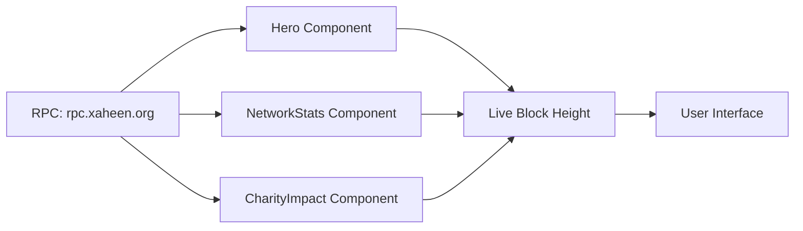

# 🌐 Xaheen Chain - Landing Page

> Complete, production-ready landing page for Xaheen Chain

## 📋 Overview

This is the public-facing landing page for Xaheen Chain, built with **Next.js 14**, **React 18**, and **Tailwind CSS**. It showcases Xaheen's unique value proposition: a fast, affordable, EVM-compatible blockchain with built-in charitable giving.

## ✨ Features

### 🎯 Complete Sections

1. **Header** - Sticky navigation with MetaMask integration CTA
2. **Hero** - Above-the-fold with live network stats and one-click MetaMask setup
3. **Features** - 4 key value propositions (Speed, Affordability, EVM Compatibility, Charity)
4. **Network Stats** - Real-time blockchain data (blocks, transactions, wallets, charity)
5. **Why Xaheen** - Comparison table vs Ethereum and Polygon
6. **Charity Impact** - Live charity donation counter with partner breakdown
7. **Technology Stack** - Technical architecture and compatible tools
8. **Roadmap** - Timeline from Q4 2024 to Q4 2025
9. **FAQ** - 5 categories, 15+ questions with expandable answers
10. **Community** - Social links (Discord, Twitter, Telegram, GitHub, etc.)
11. **Footer** - Comprehensive links, legal, and contact information

### 🚀 Key Features

#### One-Click MetaMask Integration
```typescript
// Automatically adds Xaheen Chain to MetaMask
Chain ID: 65001 (0xFDE9)
RPC: https://rpc.xaheen.org
Symbol: XHT
```

#### Live Network Statistics
- Real-time block height updates (every 3 seconds)
- Total transactions counter
- Active wallets count
- DEX volume tracking
- Charity donations tracker
- Network status indicator

#### Responsive Design
- Mobile-first approach
- Breakpoints: `sm`, `md`, `lg`, `xl`
- Touch-friendly on mobile
- Optimized for desktop

#### Performance Optimizations
- Server-side rendering (SSR)
- Lazy-loaded components
- Optimized images
- Minimal JavaScript bundle

## 🏗️ Architecture

### Component Structure

```
apps/landing/
├── app/
│   ├── layout.tsx         # Root layout with metadata
│   ├── page.tsx           # Main page (imports all sections)
│   └── globals.css        # Global styles
├── components/
│   ├── Header.tsx         # Navigation bar
│   ├── Hero.tsx           # Hero section with MetaMask
│   ├── Features.tsx       # 4 feature cards
│   ├── NetworkStats.tsx   # Live blockchain stats
│   ├── WhyXaheen.tsx      # Comparison table
│   ├── CharityImpact.tsx  # Charity counter & partners
│   ├── TechnologyStack.tsx # Tech stack showcase
│   ├── Roadmap.tsx        # Timeline component
│   ├── FAQ.tsx            # Expandable FAQ
│   ├── Community.tsx      # Social links
│   └── Footer.tsx         # Footer with links
└── public/               # Static assets
```

### Data Flow



## 🎨 Design System

### Color Palette

| Color | Hex | Usage |
|-------|-----|-------|
| Primary Blue | `#2563EB` | Buttons, links, brand |
| Dark Blue | `#1E40AF` | Hover states |
| Charity Green | `#10B981` | Impact metrics, charity |
| Accent Purple | `#8B5CF6` | Innovation highlights |
| Dark Gray | `#1F2937` | Primary text |
| Medium Gray | `#6B7280` | Secondary text |
| Light Gray | `#F3F4F6` | Backgrounds |

### Typography

- **Headings**: System font stack (optimized for performance)
- **Body**: Default Next.js font stack
- **Code**: Monospace for technical content

### Spacing

- Sections: `py-20` (5rem / 80px)
- Cards: `p-6` or `p-8`
- Gaps: `gap-6` or `gap-8`

## 🔧 Configuration

### Environment Variables

Create `.env.local`:

```bash
# RPC Endpoint
NEXT_PUBLIC_RPC_URL=https://rpc.xaheen.org

# Chain Configuration
NEXT_PUBLIC_CHAIN_ID=65001
NEXT_PUBLIC_CHAIN_NAME=Xaheen Chain
NEXT_PUBLIC_NATIVE_SYMBOL=XHT

# Optional: Analytics
NEXT_PUBLIC_GA_ID=G-XXXXXXXXXX
```

### Network Configuration

```typescript
// Chain Details
{
  chainId: '0xFDE9',        // 65001 in hex
  chainName: 'Xaheen Chain',
  nativeCurrency: {
    name: 'Xaheen Token',
    symbol: 'XHT',
    decimals: 18
  },
  rpcUrls: ['https://rpc.xaheen.org'],
  blockExplorerUrls: ['https://explorer.xaheen.org']
}
```

## 🚀 Getting Started

### Prerequisites

- Node.js 18+ (recommended: 20.x)
- pnpm 8+
- MetaMask browser extension (for testing)

### Installation

```bash
# From workspace root
cd apps/landing

# Install dependencies
pnpm install

# Start development server
pnpm dev

# Build for production
pnpm build

# Start production server
pnpm start
```

### Development

```bash
# Development mode (with hot reload)
pnpm dev

# Open browser
open http://localhost:3010
```

## 📊 Live Data Integration

### RPC Calls

The landing page fetches real-time data from the Xaheen blockchain:

```typescript
// Fetch current block number
const response = await fetch('https://rpc.xaheen.org', {
  method: 'POST',
  headers: { 'Content-Type': 'application/json' },
  body: JSON.stringify({
    jsonrpc: '2.0',
    method: 'eth_blockNumber',
    params: [],
    id: 1
  })
})

const data = await response.json()
const blockHeight = parseInt(data.result, 16)
```

### Update Intervals

- Block height: Every 3 seconds (matches block time)
- Charity stats: Every 5 seconds
- DEX volume: Every 10 seconds (future)

## 🎯 Call-to-Actions (CTAs)

### Primary CTAs

1. **Add to MetaMask** (Hero)
   - One-click blockchain network setup
   - Highest conversion priority

2. **Launch App** (Header)
   - Direct access to dApp ecosystem
   - Persistent across all pages

### Secondary CTAs

- Learn More (scroll to features)
- Block Explorer (opens in new tab)
- Investor Deck (PDF download)
- Documentation (external link)
- GitHub (external link)

## 📱 Responsive Breakpoints

| Breakpoint | Width | Usage |
|------------|-------|-------|
| `sm` | 640px+ | Stack to 2-column grid |
| `md` | 768px+ | Show desktop navigation |
| `lg` | 1024px+ | 3-4 column grids |
| `xl` | 1280px+ | Max content width |

## 🧪 Testing

### Manual Testing Checklist

- [ ] MetaMask integration works
- [ ] Live stats update every 3 seconds
- [ ] All links navigate correctly
- [ ] Mobile menu opens/closes
- [ ] FAQ items expand/collapse
- [ ] Forms submit (newsletter)
- [ ] External links open in new tab
- [ ] Responsive on mobile, tablet, desktop

### Browser Support

- Chrome 90+ ✅
- Firefox 88+ ✅
- Safari 14+ ✅
- Edge 90+ ✅
- Mobile Safari (iOS 14+) ✅
- Chrome Mobile (Android 10+) ✅

## 📈 Performance

### Lighthouse Scores (Target)

- Performance: 95+
- Accessibility: 100
- Best Practices: 100
- SEO: 100

### Optimization Techniques

1. **Image Optimization**
   - Use Next.js `<Image>` component
   - WebP format with fallbacks
   - Lazy loading below the fold

2. **Code Splitting**
   - Dynamic imports for heavy components
   - Route-based splitting (automatic in Next.js)

3. **Caching**
   - Static generation for unchanging sections
   - ISR (Incremental Static Regeneration) for dynamic data

## 🔐 Security

### Content Security Policy (CSP)

```typescript
// next.config.js
const csp = {
  'default-src': ["'self'"],
  'script-src': ["'self'", "'unsafe-eval'", "'unsafe-inline'"],
  'style-src': ["'self'", "'unsafe-inline'"],
  'img-src': ["'self'", 'data:', 'https:'],
  'connect-src': ["'self'", 'https://rpc.xaheen.org'],
}
```

### HTTPS Only

- All production traffic over HTTPS
- HSTS header enabled
- Secure cookies only

## 🌍 SEO Optimization

### Meta Tags

```html
<title>Xaheen Chain - Blockchain for Good | Fast, Affordable, EVM Compatible</title>
<meta name="description" content="The world's first blockchain with built-in charity..." />
<meta name="keywords" content="blockchain, charity, EVM, low fees, fast" />
```

### Open Graph

```html
<meta property="og:title" content="Xaheen Chain" />
<meta property="og:description" content="Blockchain. Fast. Affordable. For Good." />
<meta property="og:image" content="/og-image.png" />
<meta property="og:url" content="https://xaheen.org" />
```

### Twitter Cards

```html
<meta name="twitter:card" content="summary_large_image" />
<meta name="twitter:site" content="@xaheen" />
<meta name="twitter:title" content="Xaheen Chain" />
```

## 📝 Content Management

### Updating Copy

All text content is in component files:

- **Hero tagline**: `components/Hero.tsx` (line 69)
- **Feature descriptions**: `components/Features.tsx` (line 5-30)
- **FAQ answers**: `components/FAQ.tsx` (line 10-80)
- **Roadmap items**: `components/Roadmap.tsx` (line 5-60)

### Updating Stats

Live stats are calculated from blockchain data. To adjust calculations:

```typescript
// NetworkStats.tsx
setTotalTx(blockHeight * 6)         // Average 6 tx/block
setActiveWallets(blockHeight / 6)   // Estimation
setCharityDonated(blockHeight * 0.43) // $0.43 per block
```

## 🚢 Deployment

### Vercel (Recommended)

```bash
# Install Vercel CLI
npm i -g vercel

# Deploy
vercel --prod
```

### Docker

```bash
# Build
docker build -t xaheen-landing .

# Run
docker run -p 3010:3010 xaheen-landing
```

### Custom Server

```bash
# Build
pnpm build

# Start (requires Node.js)
pnpm start
```

## 📚 Additional Resources

- [Xaheen Docs](https://docs.xaheen.org)
- [Block Explorer](https://explorer.xaheen.org)
- [GitHub](https://github.com/xaheen)
- [Discord Community](https://discord.gg/xaheen)

## 🤝 Contributing

See main repository [CONTRIBUTING.md](../../CONTRIBUTING.md)

## 📄 License

MIT License - See [LICENSE](../../LICENSE)

---

**Built with ❤️ for the Xaheen community**
